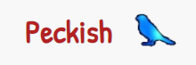
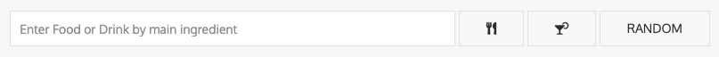
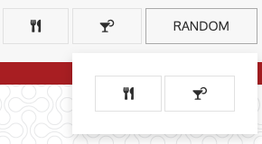
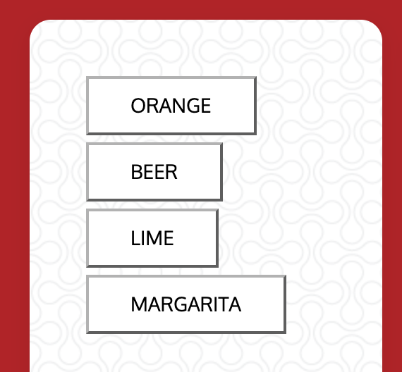

# Peckish: A Recipe Application

## Description
The Peckish application helps users search for and discover new and exciting food and drink recipes without having to purchase a cookbook. This is project 1 for the UCF Fullstack Web Development Bootcamp. Contributors for this project are Alyssa DeMetro, Brandon Green, Bridget Shannon, and Erika Zibelnik.
- Github Repository: https://github.com/BrandonGreenOAB/Peckish
- Github Page: https://brandongreenoab.github.io/Peckish/ 

## APIs and Libraries
- TheMealDB API
- TheCocktailDB API 
- UiKit framework
- FontAwesome
- Google Fonts

## Features
- Users can search for a food or drink recipe by entering an ingredient or recipe name in the search bar.
    - The user then clicks the food or drink button to search the meal or cocktail API. 
    
    - The user can hover over the random button which shows another set of food or drink icons.
        - When the user presses either of them, a random food or drink recipe will be picked for them.
          
- Users are then presented with an image of the food or drink, the ingredients needed, and the instructions.

- When a user searches for a food or drink recipe, their recent search will display as a button in the aside that they can press and go back to that recipe.

- The bottom social media and food inspiration div allow for the user to share the Peckish github page to their Twitter, FaceBook, or LinkedIn accounts. 
    - Users can also click on the book, icecream, plant, or video icons to access more digital recipes, dessert recipes, vegetarian/vegan recipes, and a recipe vlog.
    